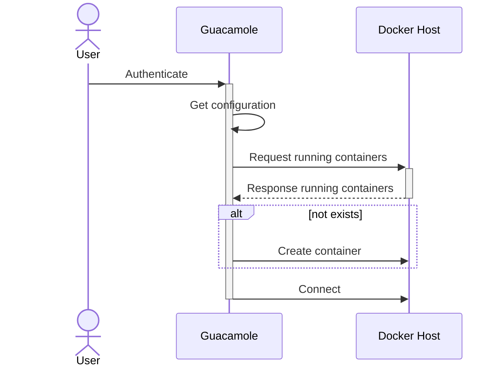

# Guacamole Docker On-Demand Manager

[](https://github.com/bwInfoSec/guacamole_ext_docker-manager/actions/workflows/maven.yml)

A Guacamole Extention, which listens for authentications and provides docker containers on demand.

## Abstract

Guacamole Docker Manager derived from the use case to provide container, such as [rdesktop](https://github.com/linuxserver/docker-rdesktop), to users on-demand. However, managing containers on the terminalserver is a bit tricky, so that is why we implemented this extension. The sequence diagramm below shows the intended workflow:



## Getting Started

```sh
cd guacamole-docker-manager
mvn clean compile assembly:single
```

```yml
---
- name: Deploy Docker extension
  hosts: guacamole
  become: true
  gather_facts: false
  tasks:
    - name: upload jar
      ansible.builtin.copy:
        src: ./guacamole_ext_docker-manager/guacamole-docker-manager/target/guacamole-docker-manager-1.0-SNAPSHOT-jar-with-dependencies-and-exclude-classes.jar
        dest: /etc/guacamole/extensions/guacamole-docker-manager.jar

    - name: Restart Tomcat
      ansible.builtin.service:
        name: tomcat9
        state: restarted
```

## Variables

- `docker-extension-image`: Docker image that is started during connection (__IMPORTANT__: The image has to available, an auto-pull feature has not been implemented so far).
- `docker-extension-exposed-port`: The exposed port of the image. Default: `3389`
- `docker-extension-cert`: Certification path to connect to Docker host, see [Docker remote configuration](https://docs.docker.com/config/daemon/remote-access/) for more information.
- `docker-extension-additional-env`: Additional environment variables to pass to Docker container, format `VAR_NAME=VAR_VALUE,VAR_NAME=VAR_VALUE,...`

### Connection setup

Each user needs a created connection in Guacamole, so that our extension can provide the container during connection.

- `hostname=1.1.1.1`
- `password=...`
- `port=....`
- `username=...`

## Requirements

- Maven `3.8.6`
- Jave `1.8`
- Guacamole `1.4.0`
